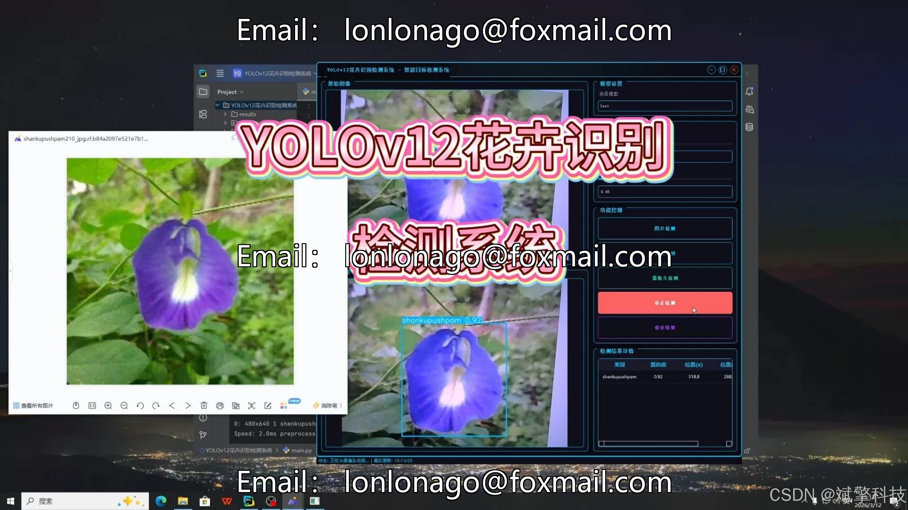
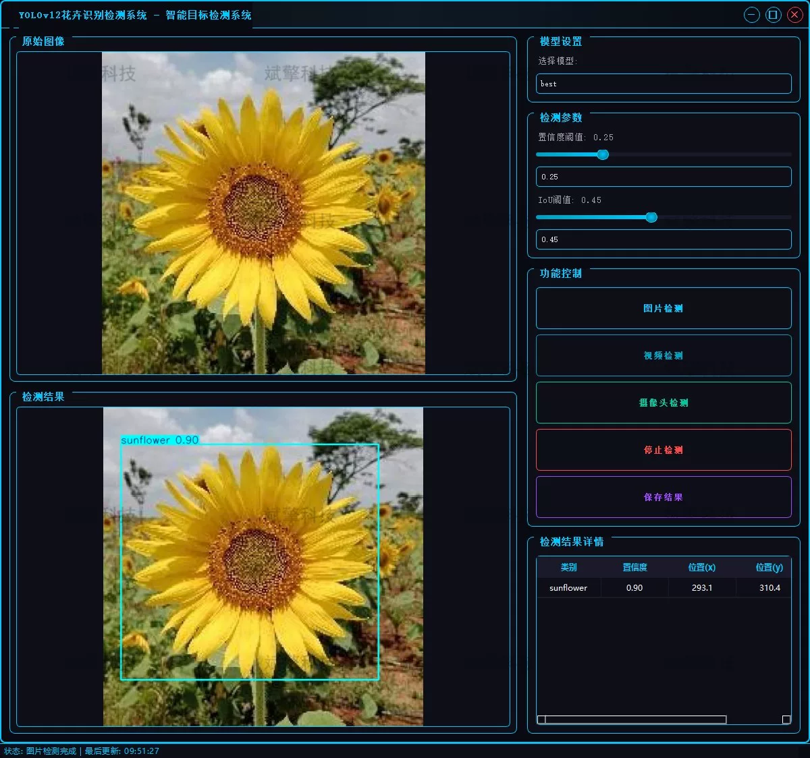
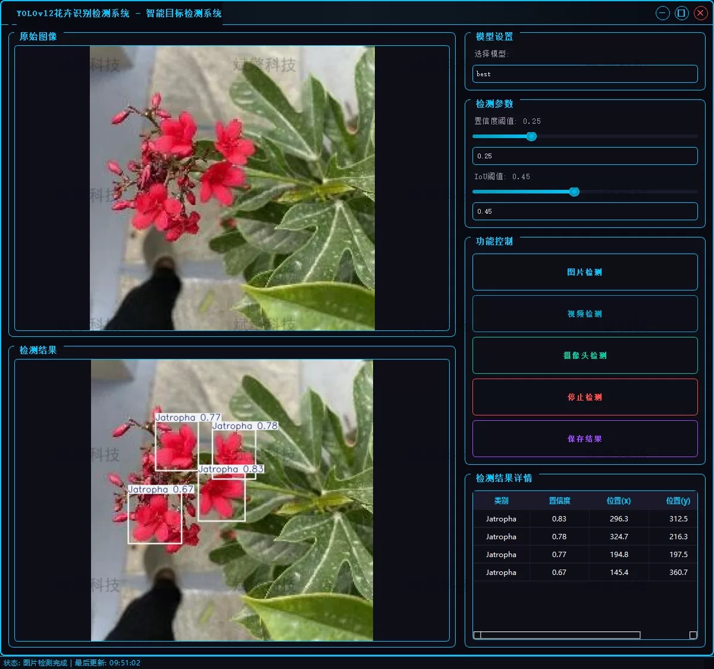
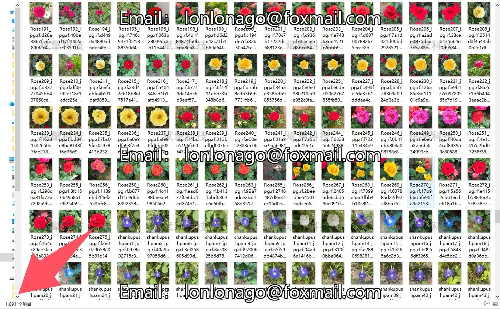
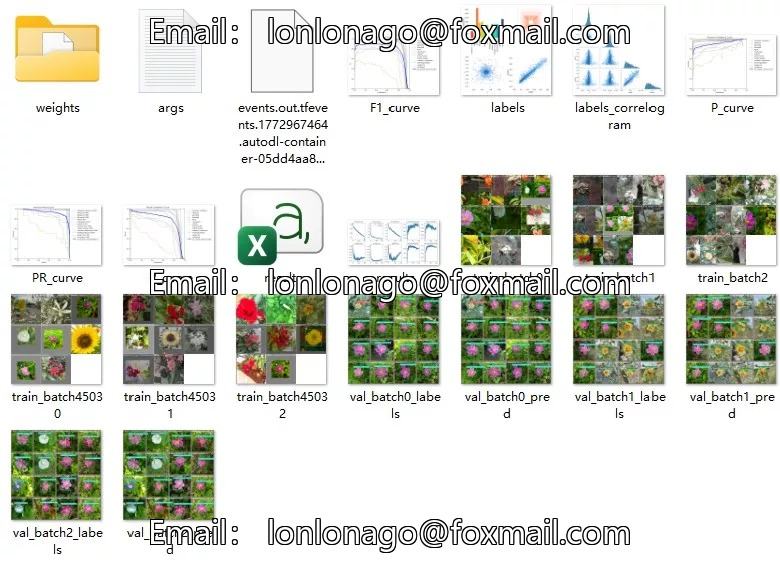
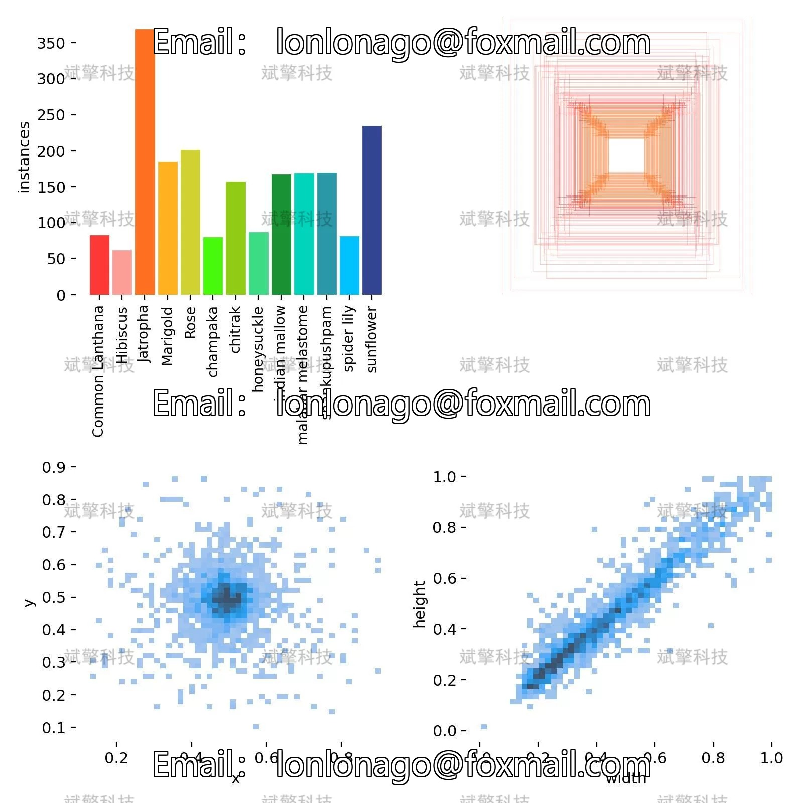
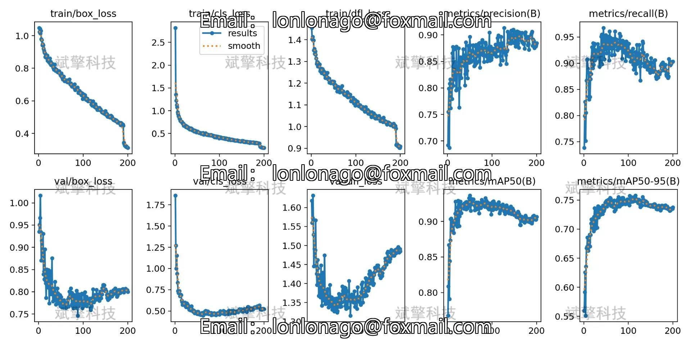
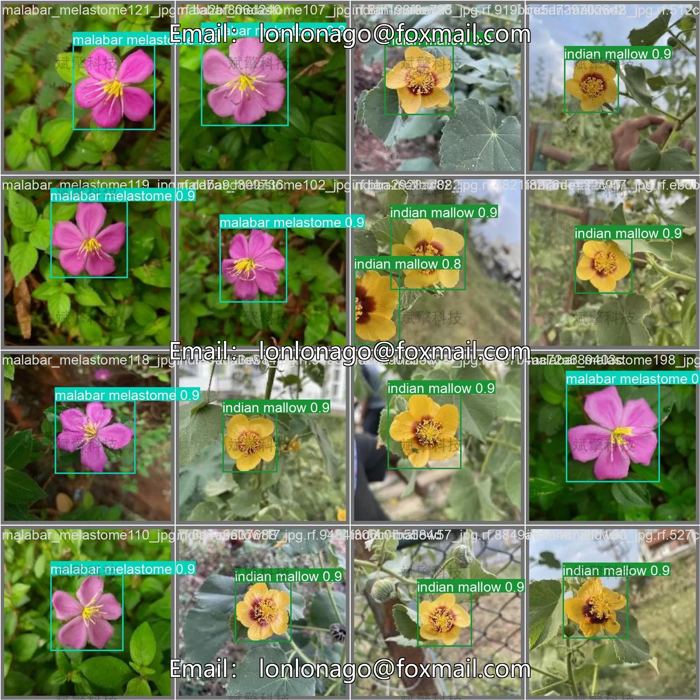

# YOLOv12 Flower Recognition Software Resources

## Body

YOLOv12 Flower Recognition Software Resource Sharing - Deep Learning YOLOv12-based Flower Recognition and Detection System (YOLOv12+YOLO dataset + UI interface + login registration interface + Python project source code + model)

This project is based on the latest YOLOv12 deep learning object detection algorithm, developing a set of flower recognition and detection systems. The system can achieve high-precision real-time detection and recognition of 13 different types of flowers, including common garden and wildflower varieties. As the latest member of the YOLO series, YOLOv12 maintains the advantages of real-time detection speed while significantly improving small target detection and feature extraction capabilities through improved network structure and attention mechanism, making it particularly suitable for flower detection tasks with diverse shapes and large scale variations.
The YOLOv12-based flower recognition and detection system is an intelligent recognition tool that integrates the latest object detection technology and user-friendly interface. The system is developed using Python and PyTorch frameworks, utilizing the YOLOv12 algorithm to perform real-time detection and recognition of 13 specific flowers. The system design considers different usage scenarios, capable of processing static images and videos as well as connecting cameras for real-time detection, offering good practicality and extensibility.

System Function Overview

✅ User Login and Registration: Supports password verification and security validation.

✅ Three Detection Modes: Based on the YOLOv12 model, supports image, video, and real-time camera detection, accurately recognizing targets.

✅ Dual Screen Comparison: Display original images and detection results on the same screen.

✅ Data Visualization: Real-time table displaying the category, confidence, and coordinates of detected targets.

✅ Intelligent Parameter Tuning: Offers a confidence slide bar, dynamically optimizing detection accuracy to meet different scene needs.

✅ Sci-Fi Style Interactive Interface: Dark theme combined with dynamic light effects, reducing visual fatigue and enhancing operational experience.

✅ High-Performance Multi-Thread Architecture: Independent detection threads ensure smooth operation, real-time status prompts, and rapid response without lag.

Dataset Introduction

Training Set: 1891 images
Validation Set: 529 images
Test Set: 326 images

## Images

## Payment

Here is a pay link on Stripe ( https://buy.stripe.com/3cs8yP7sY87d0vu9AB ). Please contact me lonlonago@foxmail.com after funding $89, and I will send you a complete data files , thank you!

